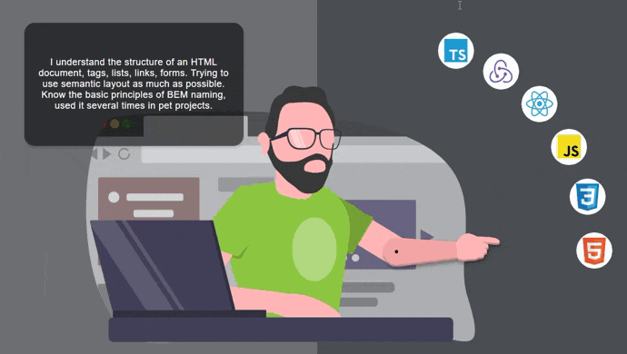

# My portfolio

This project was bootstrapped with [Create React App](https://github.com/facebook/create-react-app).

### Some information about me and my skills.

Project can be viewed at https://my-portfolio-taupe-one.vercel.app/about

Here you can learn a little about me:
- My skills and tools that I use
- My pet projects
- My contacts and other links

In this project I used:

- React
- react-create-app
- react-router
- styled-components
- react-hook-form
- react-transition-group

You can run this project locally just do:

Clone branch master with git clone https://github.com/AntonVMV/my-portfolio.git

- cd portfolio
- npm install
- npm start
